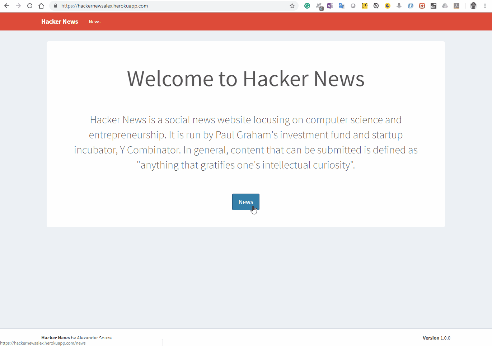

# Hacker News V3.0

#### Access URL for the Hacker News page:
- https://hackernewsalex.herokuapp.com/ 

## Technology

> For this project I will use various technologies, techniques and tools, such as:

### IDE - Development environment
- Visual Studio Code

### Front end
- HTML5 and CSS
- Angular 5
- Bootstrap

### Cloud services
- Heroku

## Author
### Alexander Souza
- alexpt2000@gmail.com
- https://github.com/alexpt2000
- www.linkedin.com/in/souza-alexander

